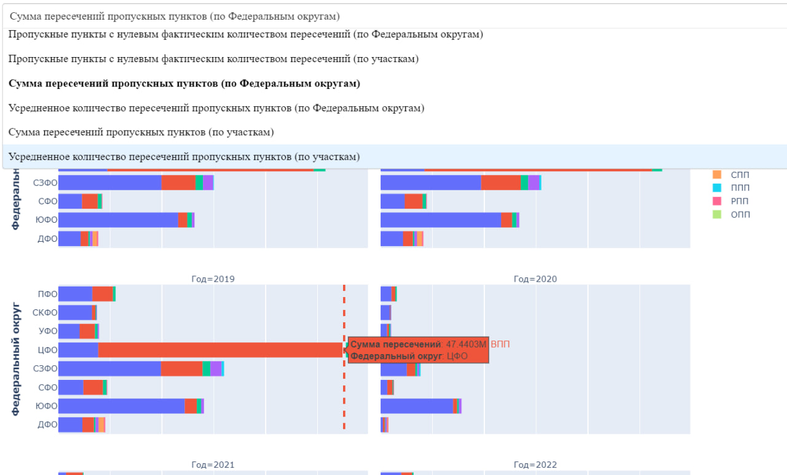

# Визуализация данных по пограничным пропускным пунктам РФ


_____________________________________________________________________________




#### В веб-приложении представлена статистика по пунктам пропуска через государственную границу РФ за 2017-2022, [данные](data/Копия%20ПП.xlsx) предоставлены Дирекцией по стрфоительству и эксплуатации объектов Росграницы Министерства транспорта РФ

## Как запустить приложение локально?
Создайте виртуальную среду и установите в нее все нужные библиотеки

```
git clone https://github.com/uroplatus/Dash
cd Dash
python3 -m virtualenv venv
```
Активируйте виртуальную среду (Windows): 

```
venv\Scripts\activate
```

Установите нужные библиотеки:

```
pip install -r requirements.txt
```

Запустите код
